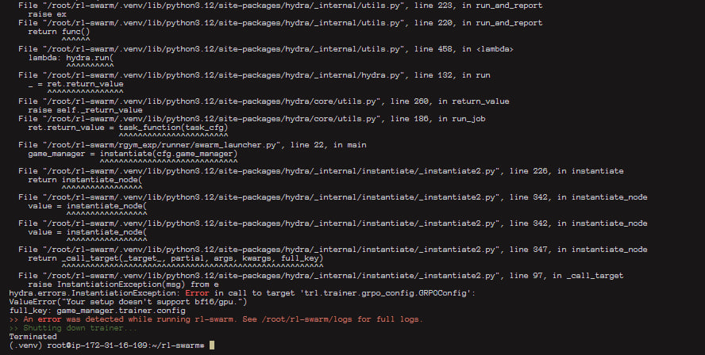

# 🐝 RL-Swarm Quick Fix Guide

This guide explains how to fix the `trl.trainer.grpo_config.GRPConfig` error when running **RL-Swarm** in a `.venv` environment on a VPS.

---

## 📸 Error Screenshot




---

## 🛠 Steps to Solve

1. **Ensure you are inside the same screen session** where you were running RL-Swarm, and that your `.venv` environment is activated.

2. **Reinstall the required versions of `transformers` and `trl`** to ensure compatibility:

```bash
pip install --force-reinstall transformers==4.51.3 trl==0.19.1
```

3. **Run the reinstall command again** to clear any leftover dependency issues:

```bash
pip install --force-reinstall transformers==4.51.3 trl==0.19.1
```

4. **Start the RL-Swarm training process again**:

```bash
bash run_rl_swarm.sh
```

---

## ✅ Done!

Your RL-Swarm should now run without the `GRPConfig` instantiation error.

---

**Created by:** Satyam Jha
⭐ If you found this helpful, don’t forget to star the repo!
